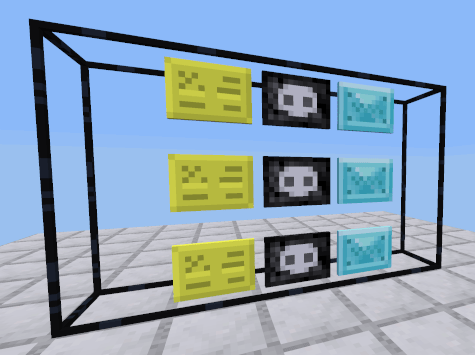

Minetest MOD X Markeplace [x_marketplace]

This MOD for Minetest adds a simple global marketplace to the game. This marketplace is designed to work only with chat commands. Type `/mp help` in the chat to see all possible commands.

Currently only items from `default` MTGame MOD are in the store list, since all the other items can be crafted from default blocks, this is sufficient for balanced game.

Items can be added/removed/edited easily from the `store_list.lua` file.

Commands:

- `/mp find <item name>`, find item in store
- `/mp balance`, show your current balance in BitGold
- `/mp sellhand`, sell item(s) currently holding in hand
- `/mp buyhand [<amount>]`, buy `<amount>` of item(s) currently holding in hand, when `<amount>` is not provided then amount is 1
- `/mp infohand`, show more information about the item(s) you are currently holding in hand from the store
- `/mp buy <item name> [<amount>]`, buy `<amount>` of `<item name>` from store, if `<amount>` is not provided then amount is 1
- `/mp sellinv <item name>`, sell all items `<item name>` from the 'main' inventory list
- `/mp buyinv <item name>`, buy full inventory of items `<item name>`, empty slots in the 'main' inventory are required
- `/mp top`, show top 5 richest players currently online
- `/mp help`, print out this help
